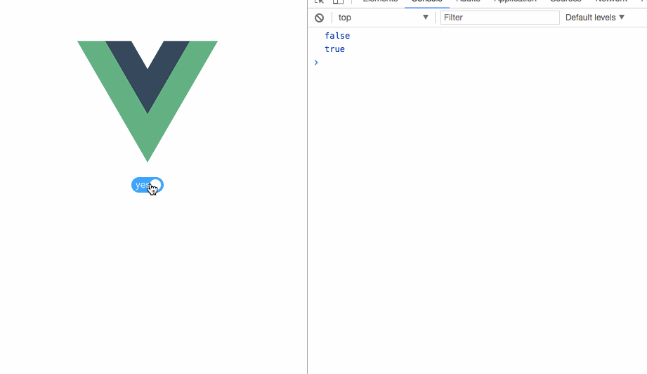

# switch 插件

> npm i zlSwitch --save




### input checkbox 美化插件

```
  <zl-switch v-on:input="checkedInput" zlNo="no" zlYes="yes"></zl-switch>

```

```

 checked            首次进入的时候是否选择 
 zlNo               false的时候显示文字 
 zlYes              true的时候显示的文字 
 offColor           false的时候背景色   默认'#bfcbd9'
 onColor            true的时候背景色   默认 '#20a0ff' 
 v-on:input         传给父组件的值
 ```